# TestGen AI 测试用例生成平台

## 项目简介

TestGen 是一个基于 Flask 的 Python 应用，使用 AI 驱动的 LLM 和 RAG（检索增强生成）架构自动从需求文档生成测试用例。

该平台实现了一个**两阶段生成管道**：
- **Phase 1（同步）**：文档上传 → 需求分析 → 测试计划 → 等待人工评审
- **Phase 2（异步）**：RAG 召回 → LLM 生成 → 保存结果（暂存内存，需手动入库）

## 项目特点

- **AI 驱动**：利用先进的 LLM 模型自动生成高质量测试用例
- **RAG 增强**：结合历史数据和相似案例，提高生成质量
- **多格式支持**：支持 docx、pdf、txt、图片和 markdown 等多种文档格式
- **多格式导出**：支持 Excel、XMind 和 JSON 格式的测试用例导出
- **异步处理**：后台线程处理生成任务，提供实时进度查询（WebSocket + 轮询）
- **人工介入**：Phase 1 完成后支持人工评审和修改测试计划，确认后再进入 Phase 2
- **完整的工作流**：从需求管理到测试用例生成、评审和管理的完整流程
- **缺陷知识库**：支持维护缺陷数据，用于 RAG 检索增强

## 技术栈

- **Python 3.14**、**Flask**（Web 框架）
- **SQLAlchemy**（SQLite 数据库 ORM）
- **ChromaDB**（RAG 语义搜索向量数据库）
- **Flask-SocketIO**（WebSocket 实时推送）
- **FTS5**（SQLite 全文搜索）
- **openpyxl, xmind**（测试用例导出格式）
- **python-docx, PyPDF2, pytesseract, opencv-python**（文档解析）

## 快速开始

### 安装依赖

```bash
pip install -r requirements.txt
```

### 初始化数据库

```bash
python init_db.py
```

### 运行应用

```bash
python app.py
```

访问地址：`http://localhost:5000`

## 功能模块

### 平台首页导航

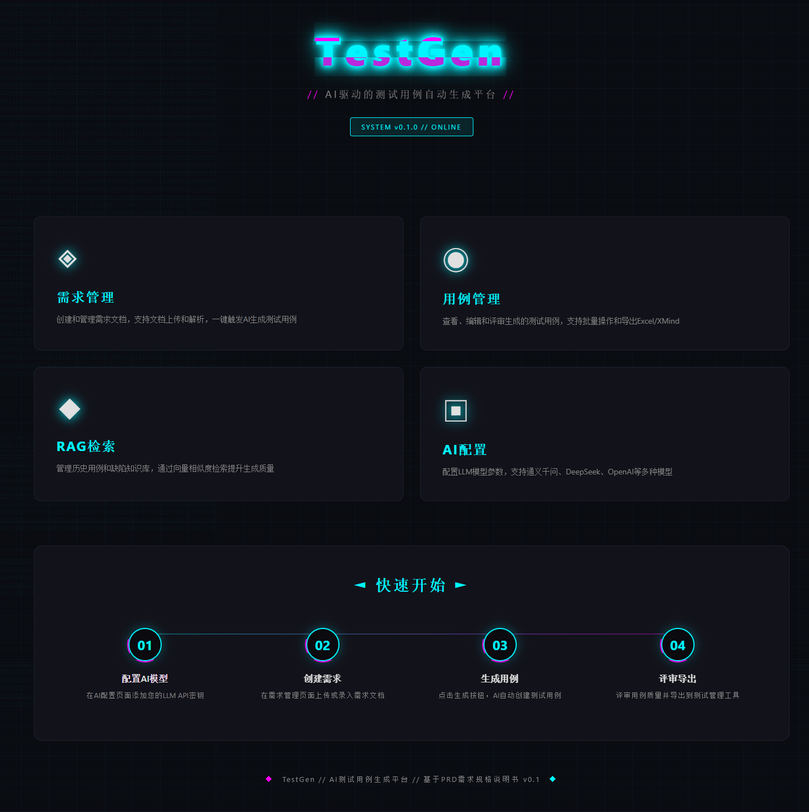

平台提供直观的导航界面，包含需求管理、测试用例管理、RAG 语义搜索、提示模板管理和 AI/LLM 配置等主要功能模块。

### 需求管理

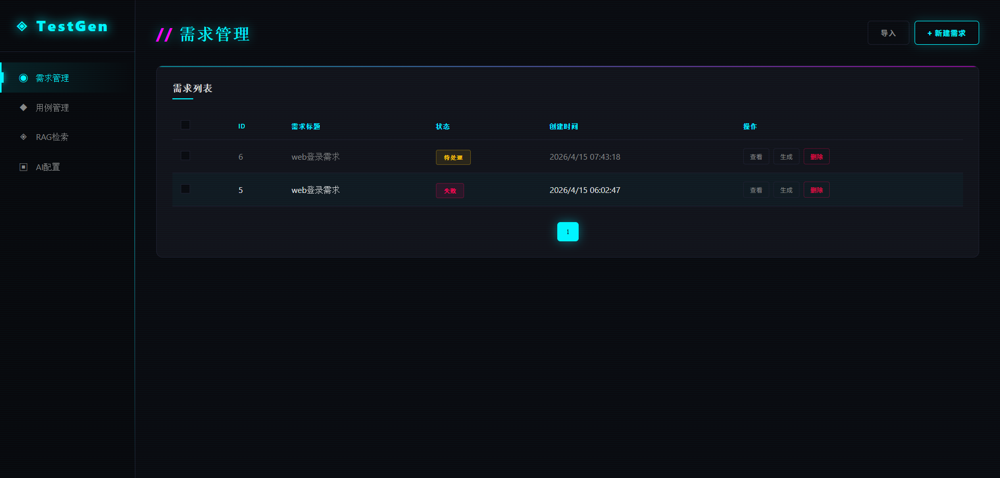

管理所有需求文档，支持查看、编辑、删除、批量删除操作。需求分析后进入人工评审流程。

### 新增需求文档

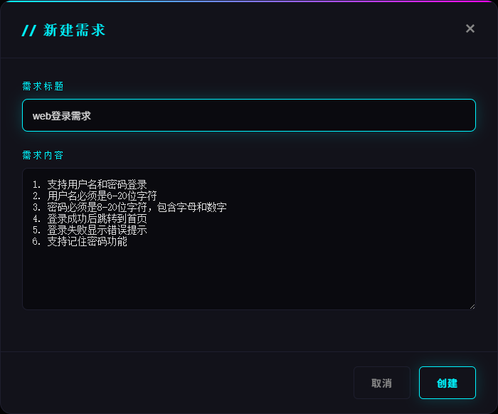

上传新的需求文档，支持多种格式，系统会自动分析文档结构和内容。

### 需求生成测试用例

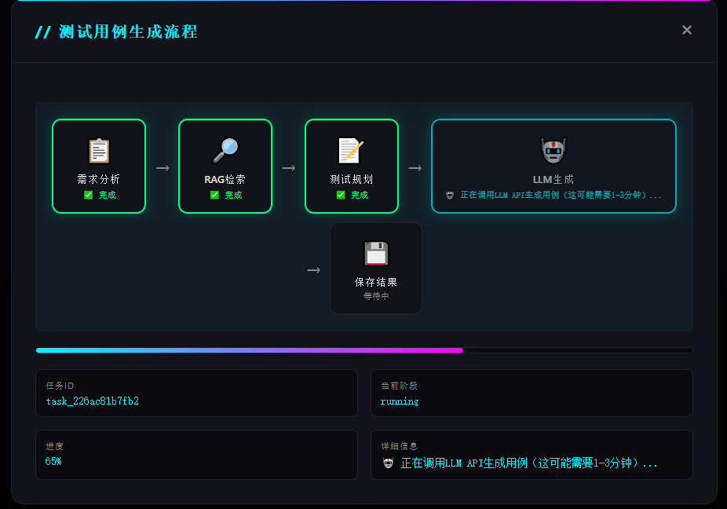

基于需求文档生成测试用例，系统会执行完整的两阶段生成流程。Phase 1 完成后弹出评审窗口，用户可编辑测试计划后再继续 Phase 2。

### 测试用例管理

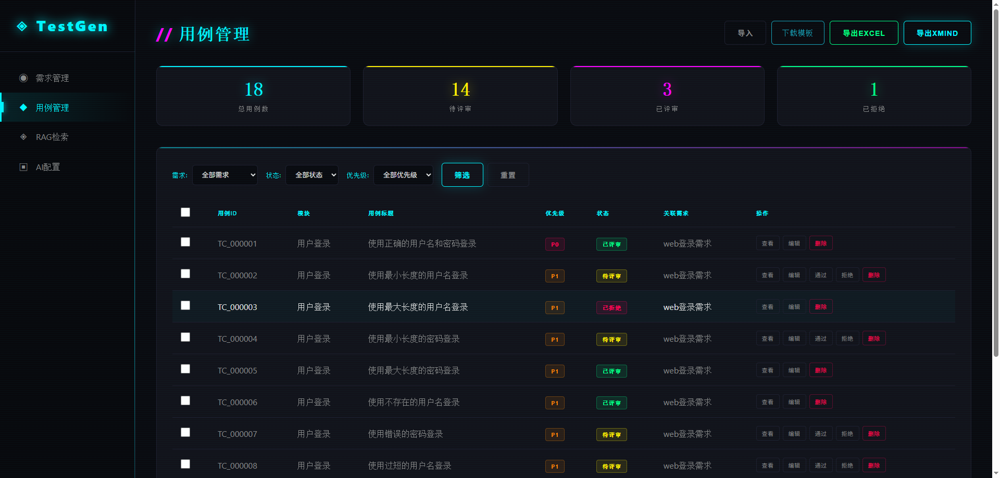

管理生成的测试用例，支持批量操作和状态更新。Phase 2 生成的用例默认暂存于内存，需点击"全部入库"才会持久化到数据库。

### 查看用例详情

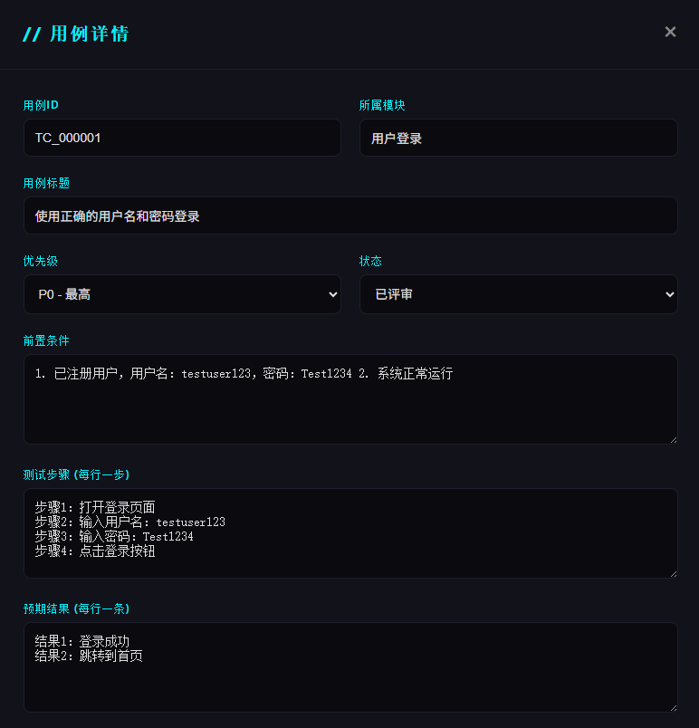

查看测试用例的详细信息，包括测试步骤、预期结果、置信度分数、引用来源等。

### AI 配置管理

#### AI 配置列表

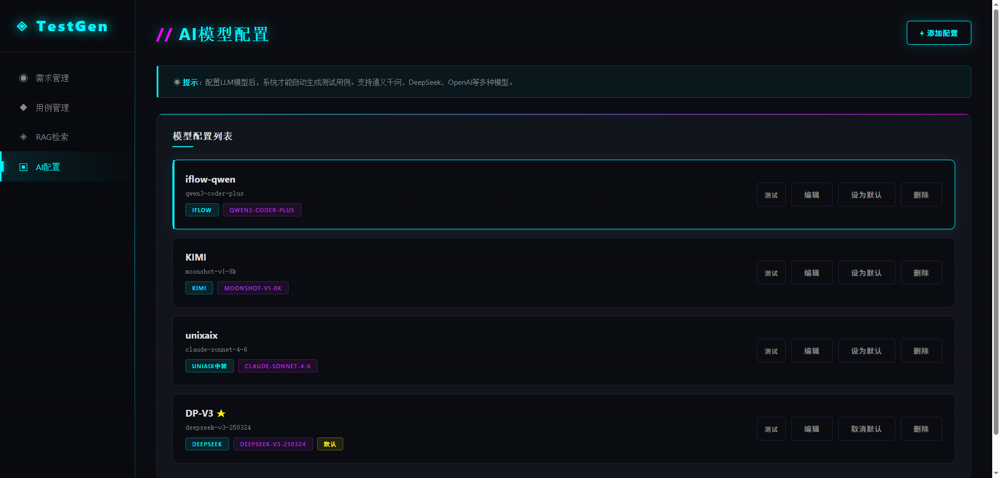

管理所有 LLM 配置，支持多种 AI 提供商（OpenAI、Qwen、DeepSeek、KIMI、智谱、Minimax、iFlow、UniAIX）。

#### 新增 LLM 配置

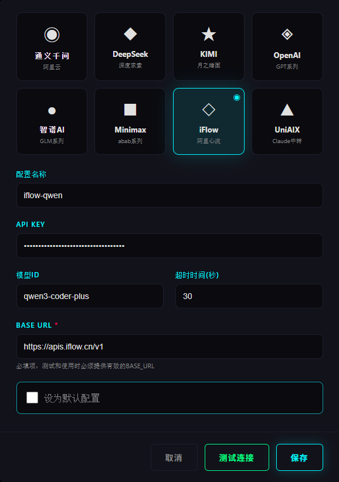

添加新的 LLM 配置，包括 API 密钥、模型选择等。

#### 测试连接 LLM

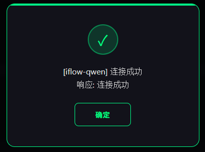

测试 LLM 连接是否正常，确保生成功能可以正常工作。

### RAG 检索增强

#### RAG 检索增强

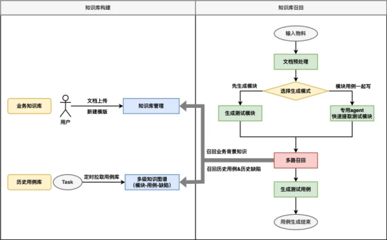

利用 RAG 技术增强生成质量，检索相关的历史数据。

#### RAG 检索--历史用例

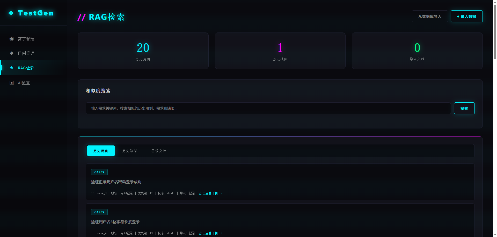

检索与当前需求相似的历史测试用例，提供参考。

#### RAG 召回 prompt

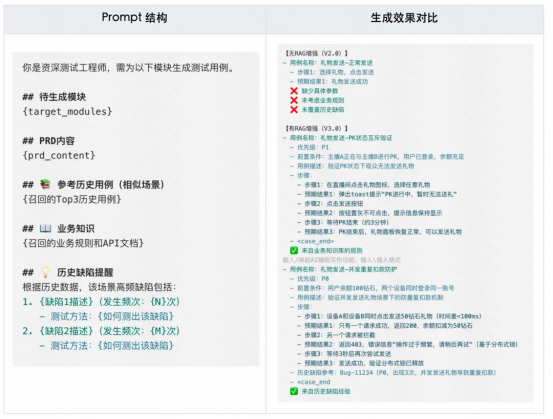

配置 RAG 召回的提示模板，优化检索效果。

### 自主评审自我进化

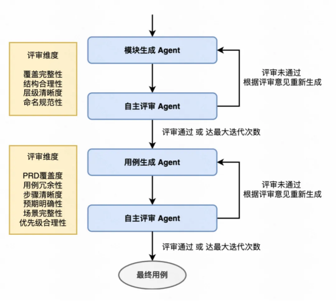

系统支持测试用例的自主评审和自我进化，不断提高生成质量。

## 架构说明

### 两阶段生成管道

```
Phase 1（同步，约 0-25% 进度）：
  文档上传 → 需求分析 → 测试计划 → 等待人工评审

用户评审并确认（通过 /api/generate/continue 或 UI 点击"确认并继续"）

Phase 2（异步，约 30-100% 进度）：
  RAG 召回 → LLM 生成 → 质量检查 → 暂存内存 → 等待入库
```

Phase 2 生成的用例保存在内存中，用户需调用 `POST /api/tasks/{task_id}/cases/commit`（"全部入库"）才能持久化到数据库。

### 核心组件

| 组件 | 路径 | 用途 |
|------|------|------|
| 数据库模型 | `src/database/models.py` | SQLAlchemy ORM：Requirement, TestCase, GenerationTask, LLMConfig, PromptTemplate, Defect, RequirementAnalysis 等 |
| LLM 适配器 | `src/llm/adapter.py` | 多提供商支持（OpenAI/Qwen/DeepSeek/KIMI/智谱/Minimax/iFlow/UniAIX），统一接口 |
| 向量存储 | `src/vectorstore/chroma_store.py` | ChromaDB 包装器，用于 RAG 检索，带 hnsw 索引验证 |
| 生成服务 | `src/services/generation_service.py` | 两阶段管道，异步任务管理，默认提示初始化 |
| 混合检索器 | `src/services/hybrid_retriever.py` | 向量 + 关键词搜索 + RRF 融合 |
| 动态检索器 | `src/services/dynamic_retriever.py` | 自适应检索策略 |
| 查询优化器 | `src/services/query_optimizer.py` | LLM 驱动的查询增强 |
| 置信度计算 | `src/services/confidence_calculator.py` | 相关性评分 |
| 引用解析器 | `src/services/citation_parser.py` | 来源归因 |
| 文档分块 | `src/services/document_chunker.py` | 文档切分处理 |
| 用例评审 Agent | `src/services/case_review_agent.py` | 自主评审和自我进化 |
| 缺陷知识库 | `src/services/defect_knowledge_base.py` | 缺陷数据管理 |
| 检索评估器 | `src/services/retrieval_evaluator.py` | RAG 检索质量评估 |
| 提示模板服务 | `src/services/prompt_template_service.py` | 模板版本管理和回滚 |
| 需求评审服务 | `src/services/requirement_review_service.py` | 需求分析结果评审 |
| API 路由 | `src/api/routes.py` | 所有操作的 RESTful 端点 |
| 文档解析器 | `src/document_parser/parser.py` | 多格式解析（docx/pdf/txt/image/markdown） |
| 用例导出器 | `src/case_generator/exporter.py` | 导出到 Excel/XMind/JSON，标准化 XMind 结构 |

## API 接口

### 需求管理

| 方法 | 端点 | 描述 |
|------|------|------|
| POST | `/api/requirements` | 创建需求 |
| GET | `/api/requirements` | 列出需求 |
| GET | `/api/requirements/{id}` | 获取需求详情 |
| PATCH | `/api/requirements/{id}` | 更新需求 |
| DELETE | `/api/requirements/{id}` | 删除需求 |
| POST | `/api/requirements/batch-delete` | 批量删除需求 |
| GET | `/api/requirements/list-all` | 列出所有需求（简化格式） |

### 需求分析与评审

| 方法 | 端点 | 描述 |
|------|------|------|
| POST | `/api/requirements/{id}/analyze` | 触发需求分析（Phase 1） |
| GET | `/api/requirements/{id}/analysis` | 获取需求分析结果 |
| POST | `/api/requirements/{id}/reset-analysis` | 重置分析状态 |
| POST | `/api/requirements/{id}/review` | 提交需求评审结果 |
| PUT | `/api/requirements/{id}/analysis-items` | 更新分析项 |
| POST | `/api/requirements/{id}/analyze/confirm` | 确认分析结果并继续 Phase 2 |
| POST | `/api/requirements/{id}/regenerate` | 基于现有分析重新生成用例 |

### 生成任务

| 方法 | 端点 | 描述 |
|------|------|------|
| POST | `/api/generate` | 触发 Phase 1 生成（返回 task_id） |
| POST | `/api/generate/continue` | 确认测试计划，进入 Phase 2 |
| POST | `/api/generate/retry` | 使用已有分析数据重试生成 |
| GET | `/api/generate/{task_id}` | 查询生成基本状态 |
| GET | `/api/generate/progress/{task_id}` | 查询详细进度（阶段、模块索引等） |

### 任务管理

| 方法 | 端点 | 描述 |
|------|------|------|
| GET | `/api/tasks` | 列出生成任务 |
| POST | `/api/tasks/{id}/cancel` | 取消进行中的任务 |
| PUT | `/api/tasks/{id}/analysis` | 更新任务分析数据 |
| POST | `/api/tasks/{id}/regenerate` | 重新生成 |
| GET | `/api/tasks/{id}/review` | 获取任务评审记录 |
| GET | `/api/tasks/{id}/rag-history` | 获取 RAG 召回历史 |
| GET | `/api/tasks/{id}/reasoning-trace` | 获取推理追踪 |
| DELETE | `/api/tasks/{id}` | 删除任务 |
| POST | `/api/tasks/batch-delete` | 批量删除任务 |
| POST | `/api/tasks/{id}/cases/commit` | 将暂存用例持久化入库（"全部入库"） |

### 测试用例

| 方法 | 端点 | 描述 |
|------|------|------|
| GET | `/api/cases` | 列出测试用例 |
| GET | `/api/cases/stats` | 用例统计 |
| GET | `/api/cases/{id}` | 获取用例详情 |
| PATCH | `/api/cases/{id}` | 更新用例（含状态变更） |
| DELETE | `/api/cases/{id}` | 删除用例 |
| POST | `/api/cases/batch-delete` | 批量删除用例 |
| POST | `/api/cases/batch-update-status` | 批量更新用例状态 |
| GET | `/api/cases/{id}/confidence` | 获取置信度详情 |
| GET | `/api/cases/{id}/citations` | 获取引用来源 |
| GET | `/api/cases/{id}/traceability` | 获取需求追溯信息 |

### RAG 管理

| 方法 | 端点 | 描述 |
|------|------|------|
| POST | `/api/rag/search` | RAG 相似性搜索 |
| POST | `/api/rag/upsert` | 插入/更新向量数据 |
| POST | `/api/rag/delete` | 删除向量数据 |
| GET | `/api/rag/stats` | RAG 统计 |
| POST | `/api/rag/import-from-db` | 从数据库导入到向量库 |
| GET | `/api/rag/imported-ids` | 获取已导入的 ID 列表 |
| GET | `/api/rag/list` | 列出 RAG 数据 |
| POST | `/api/rag/entries` | 创建 RAG 条目 |
| GET | `/api/rag/entries` | 列出 RAG 条目 |
| POST | `/api/rag/import` | 批量导入 RAG 数据 |
| GET | `/api/rag/evaluation/summary` | RAG 评估摘要 |

### 导出与导入

| 方法 | 端点 | 描述 |
|------|------|------|
| GET | `/api/export` | 查询导出文件列表 |
| POST | `/api/export/cases` | 导出用例（excel/xmind/json） |
| GET | `/api/export/download/{filename}` | 下载导出文件 |
| POST | `/api/upload` | 上传文档 |
| POST | `/api/import/requirements` | 批量导入需求 |

### LLM 配置

| 方法 | 端点 | 描述 |
|------|------|------|
| GET | `/api/llm-configs` | 列出配置 |
| POST | `/api/llm-configs` | 创建配置 |
| PATCH | `/api/llm-configs/{id}` | 更新配置 |
| DELETE | `/api/llm-configs/{id}` | 删除配置 |
| POST | `/api/llm-configs/test` | 测试连接 |
| POST | `/api/llm-configs/{id}/set-default` | 设为默认 |
| POST | `/api/llm-configs/{id}/unset-default` | 取消默认 |

### 提示模板

| 方法 | 端点 | 描述 |
|------|------|------|
| GET | `/api/prompts` | 列出模板 |
| GET | `/api/prompts/{id}` | 获取模板详情 |
| PUT | `/api/prompts/{id}` | 更新模板 |
| DELETE | `/api/prompts/{id}` | 删除模板 |
| GET | `/api/prompts/{id}/versions` | 获取版本历史 |
| POST | `/api/prompts/{id}/rollback` | 回滚到指定版本 |

### 其他

| 方法 | 端点 | 描述 |
|------|------|------|
| GET | `/api/defects` | 缺陷列表 |
| POST | `/api/fts5/rebuild` | 重建 FTS5 全文索引 |
| POST | `/api/chat` | AI 聊天接口 |

## 使用指南

1. **配置 LLM**：在 `/config` 页面配置至少一个 LLM 提供商
2. **上传需求**：在 `/requirements` 页面上传需求文档
3. **分析需求**：点击"分析"按钮触发 Phase 1，系统会分析需求并生成测试计划
4. **评审测试计划**：Phase 1 完成后弹出评审窗口，可编辑 ITEM 和 POINT
5. **生成用例**：确认测试计划后点击"确认并继续"，系统进入 Phase 2 后台生成
6. **查询进度**：通过生成任务 ID 查询生成进度，支持 WebSocket 实时推送
7. **入库用例**：Phase 2 完成后，点击"全部入库"将用例持久化到数据库
8. **管理用例**：在 `/cases` 页面管理生成的测试用例
9. **导出用例**：支持导出为 Excel、XMind 或 JSON 格式

## 注意事项

- **数据库初始化**：首次使用前需运行 `python init_db.py`
- **LLM 配置**：必须通过 `/api/llm-configs` 配置至少一个 LLM 才能生成测试用例
- **两阶段流程**：Phase 1 完成后必须人工确认才能进入 Phase 2
- **暂存机制**：Phase 2 生成结果先保存在内存中，需显式调用入库接口才能持久化
- **异步任务**：生成在后台线程运行，通过 WebSocket 或轮询查询进度
- **线程安全**：后台线程使用 `scoped_session()` 避免 SQLite 锁冲突
- **ChromaDB 索引**：如果搜索失败，索引可能损坏，使用 `fix_chroma_rebuild.py` 重建
- **提示模板**：默认模板在首次运行时初始化，可通过 `/prompts` UI 管理
- **图片解析**：需要 Tesseract OCR 安装并在系统 PATH 中
- **状态枚举**：所有状态字段使用整数枚举存储，前端自动映射为中文显示
- **数据库迁移**：如果从旧版本升级，运行 `python fix_status_column_type.py` 修复 status 列类型

## 状态枚举定义

### 需求状态 (RequirementStatus)

| 值 | 状态 | 说明 |
|---|------|------|
| 1 | 待分析 | 新创建的需求，等待分析 |
| 2 | 分析中 | LLM 正在分析需求 |
| 3 | 已分析 | 分析完成，等待生成用例 |
| 4 | 生成中 | 用例生成任务正在执行 |
| 5 | 已完成 | 用例生成完成 |
| 6 | 失败 | 生成过程出错 |
| 7 | 已取消 | 用户取消了生成 |

### 用例状态 (CaseStatus)

| 值 | 状态 | 说明 |
|---|------|------|
| 1 | 草稿 | 新生成的用例，待评审 |
| 2 | 待评审 | 等待人工评审 |
| 3 | 已通过 | 评审通过 |
| 4 | 已拒绝 | 评审拒绝 |

### 任务状态 (TaskStatus)

| 值 | 状态 | 说明 |
|---|------|------|
| 1 | 生成中 | 任务正在执行 |
| 2 | 已完成 | 任务成功完成 |
| 3 | 失败 | 任务执行失败 |
| 4 | 已取消 | 用户主动终止 |

### 生成阶段 (GenerationPhase)

| 值 | 阶段 | 说明 |
|---|------|------|
| 1 | RAG 检索 | RAG 召回阶段 |
| 2 | 用例生成 | LLM 生成用例阶段 |
| 3 | 数据保存 | 保存结果阶段 |

### 分析项状态 (AnalysisItemStatus)

| 值 | 状态 | 说明 |
|---|------|------|
| 1 | 待评审 | 分析项待评审 |
| 2 | 已通过 | 分析项已通过 |
| 3 | 已拒绝 | 分析项已拒绝 |
| 4 | 已修改 | 分析项已修改 |

## 数据库迁移工具

- `migrate_status_enum.py` - 将状态值从字符串迁移到整数枚举
- `fix_status_column_type.py` - 修复 SQLite 列类型从 VARCHAR 到 INTEGER

## 测试

```bash
# 运行全量测试
python -m pytest tests/ -v

# 运行特定测试文件
python -m pytest tests/test_api.py -v

# 运行特定测试
python -m pytest tests/test_api.py::TestRequirementAPI::test_create_requirement -v

# 带详细日志
python -m pytest tests/test_api.py -v -s --tb=long
```

## 代码质量

```bash
black .
flake8 .
```
